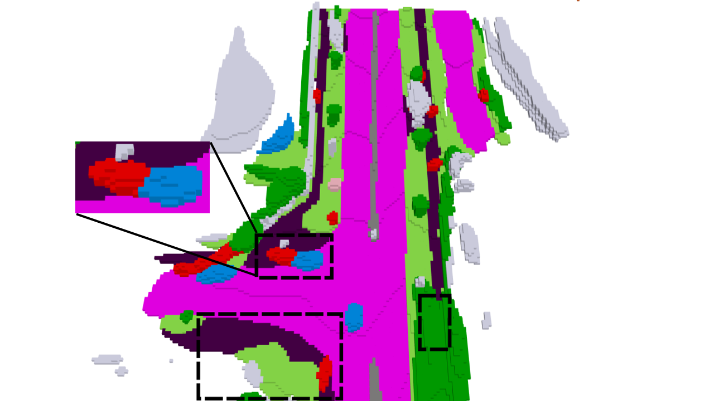
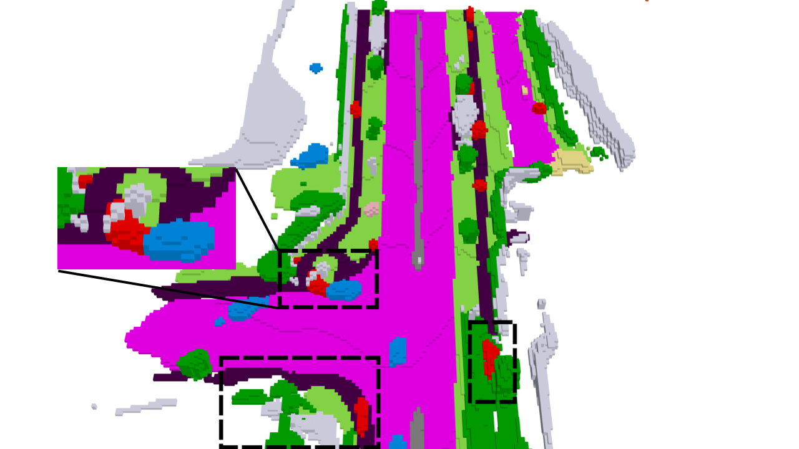
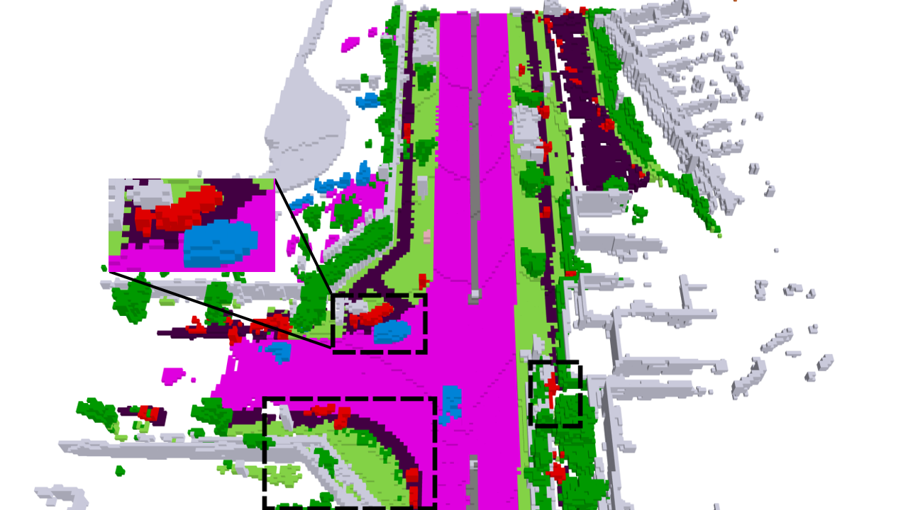
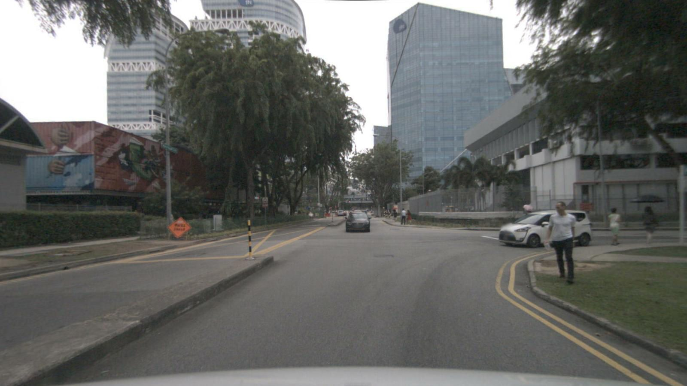
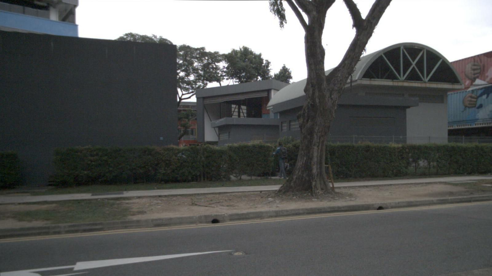

<table>
  <thead>
    <tr>
      <th>FRONT_LEFT</th>
      <th>FRONT</th>
      <th>FRONT_RIGHT</th>
      <th>GaussianFormer-2</th>
      <th>TLGauss-Occ (Ours)</th>
      <th>Ground Truth</th>
    </tr>
  </thead>
  <tbody>
    <tr>
      <td></td>
      <td></td>
      <td></td>
      <td rowspan="2"></td>
      <td rowspan="2"></td>
      <td rowspan="2"></td>
    </tr>
    <tr>
      <td></td>
      <td></td>
      <td></td>
    </tr>
  </tbody>
</table>
